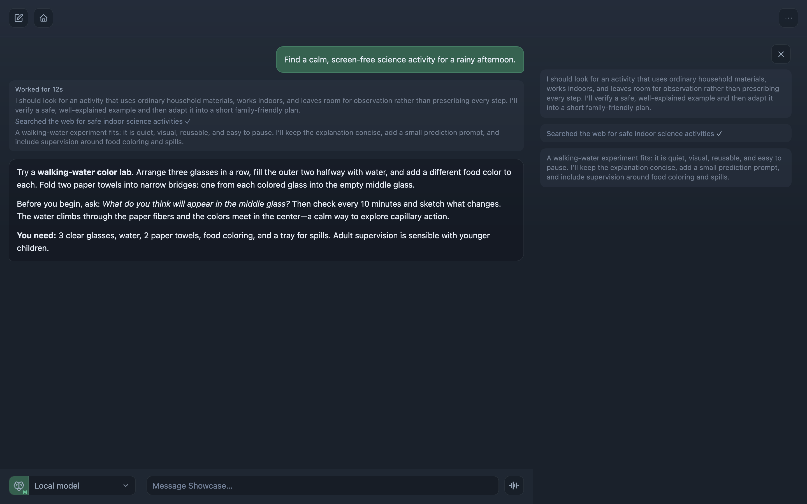
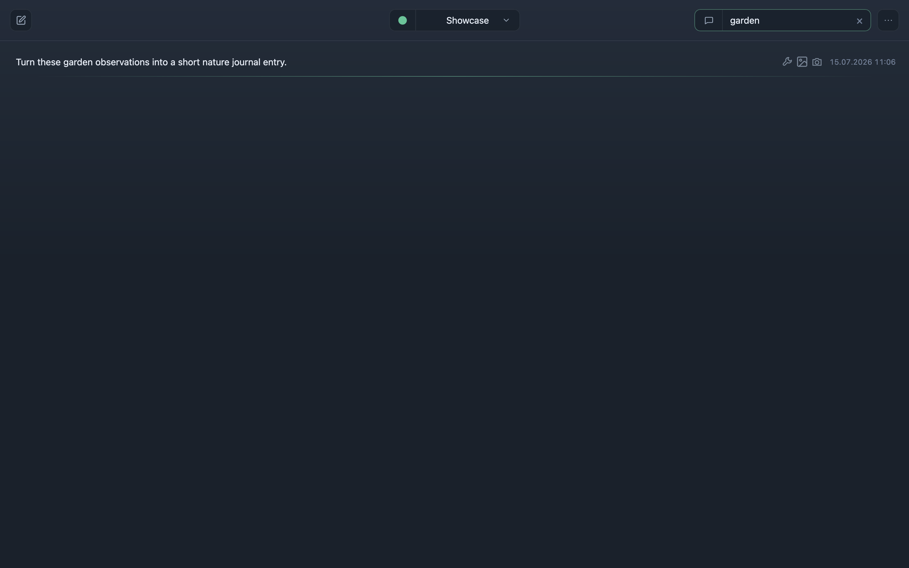
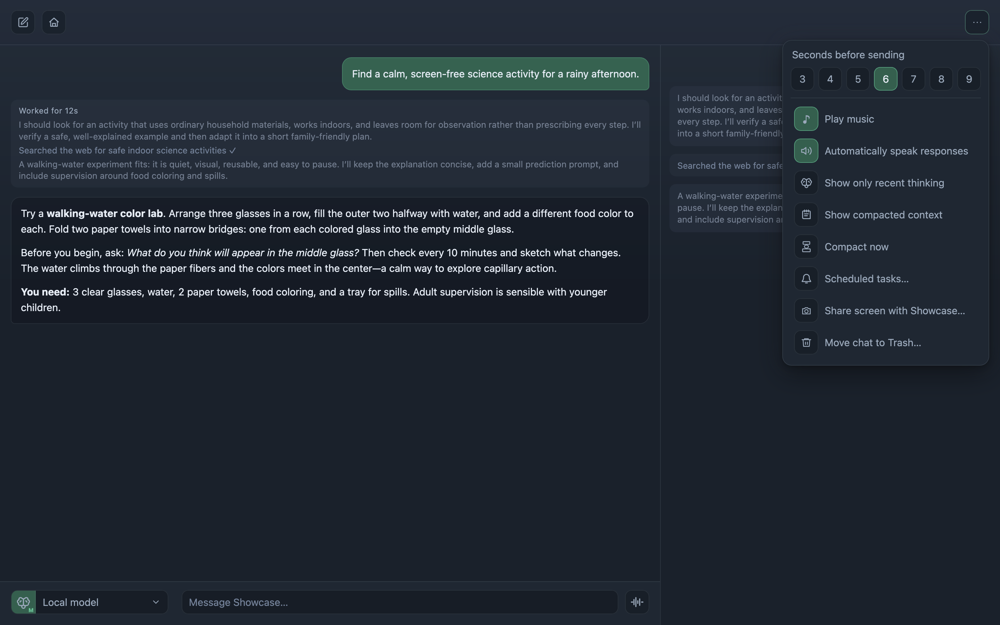
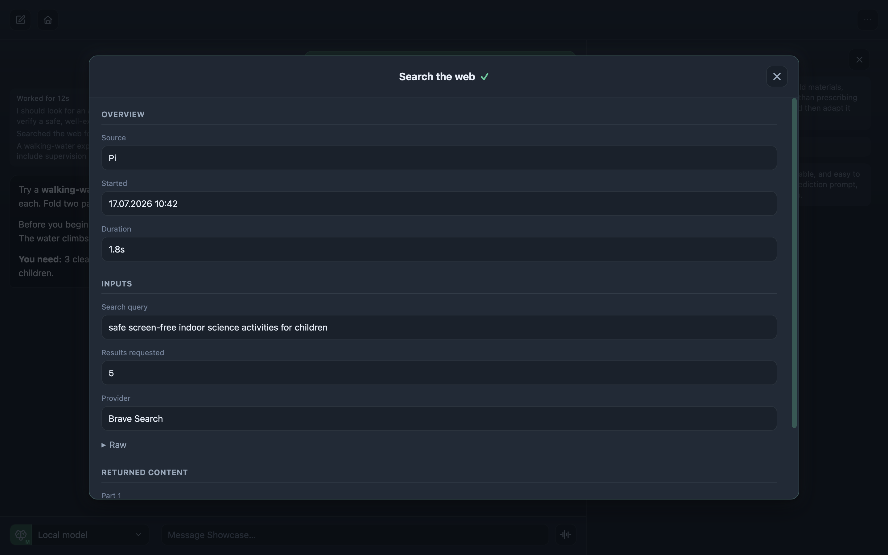
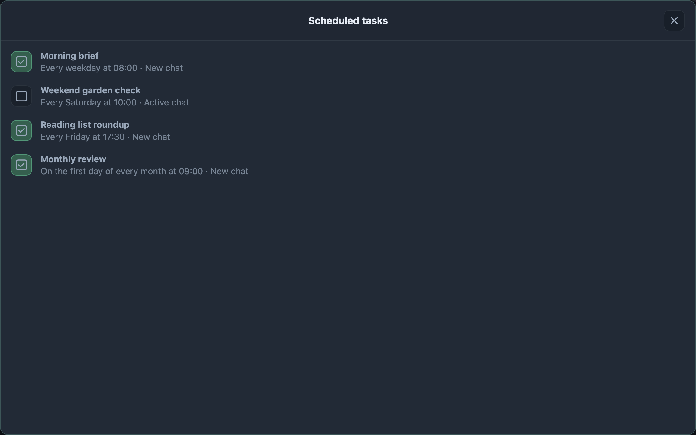
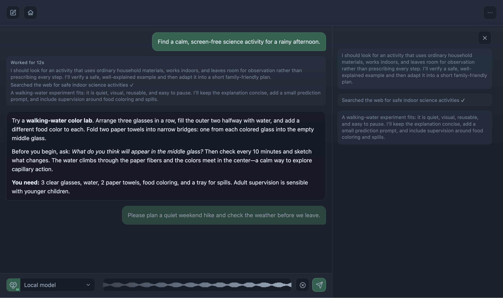
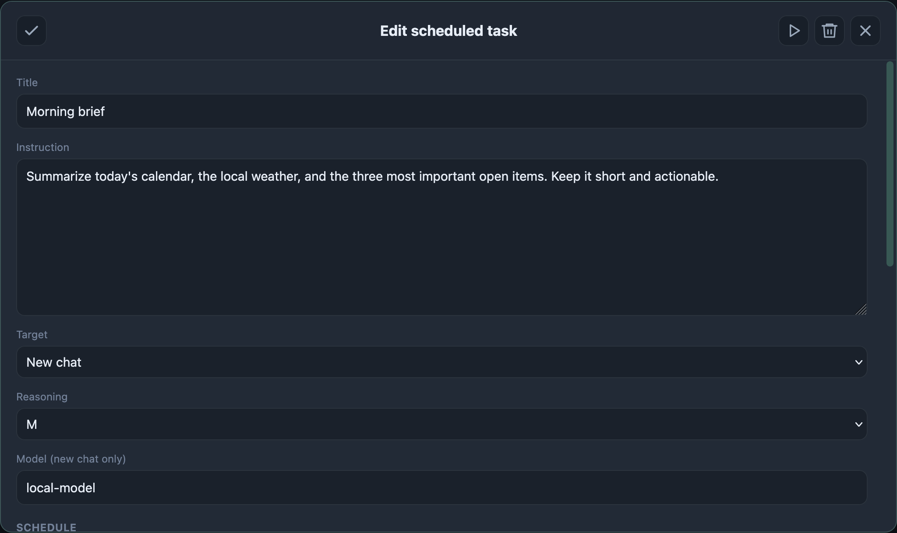
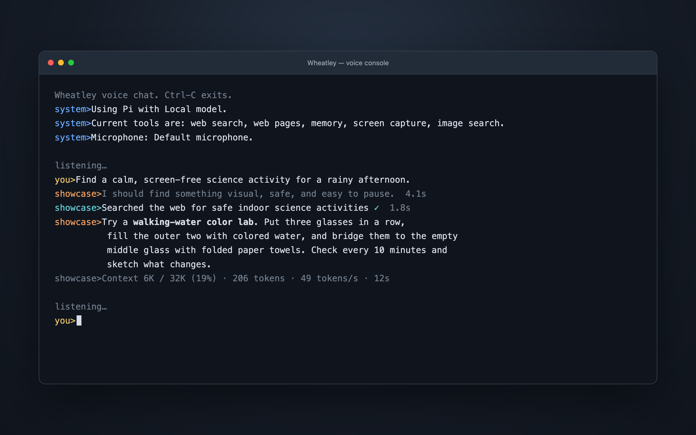

# Wheatley

Wheatley is a local-first, voice-first AI assistant for people who want the
convenience of a polished chat app without hiding the agent, its tools, or its
data behind a cloud product.

Talk naturally, type from the browser or terminal, switch models and reasoning
modes, let the assistant search or work with local tools, and inspect exactly
what happened. Profiles, conversations, memories, audio, images, tasks, and
runtime evidence stay in ordinary local files that you control.

> **Pre-release alpha.** Wheatley is capable personal software, not a hardened
> multi-user service. It is best suited to developers and technically curious
> users who are comfortable configuring a local model stack.

## Product highlights

| | |
| --- | --- |
| **Voice-native conversations** — live transcription, automatic endpointing, local speech, hands-free mode, and thinking music. | **Scheduled and recurring tasks** — real agent turns that can run once, repeat, target an active chat, or start a new one. |
| **Web and image search** — Pi can research the web, fetch pages, find visual references, and expose the exact tool exchange. | **Agentic work through Pi** — use local or hosted models with reasoning, files, shell, Python, memory, screen, camera, and image tools. |
| **Codex coding tasks** — optionally delegate longer coding work to Codex and follow its progress from the conversation. | **Local-first and inspectable** — profiles, chats, audio, tasks, artifacts, reasoning, and tool evidence remain under your control. |

## The product



- **Natural voice conversations** — live partial transcription while you
  speak, authoritative final transcription with whisper.cpp, automatic
  endpointing, replayable user audio, and browser or native-console capture.
- **Hands-free and deliberate voice modes** — keep the microphone open across
  turns, use automatic response speech, or keep both speech and microphone
  control manual. Wheatley preserves accepted turns while the next one is
  being dictated.
- **Models and reasoning modes** — choose any model exposed by Pi, then select
  only the reasoning efforts that model actually supports. A spoken or typed
  leading `think` can request the strongest mode for one turn without changing
  the profile default.
- **English, Slovak, and German** — localized browser and console experiences,
  whisper.cpp speech recognition, local Piper English speech, Supertonic
  Slovak and German speech, streaming playback, listening chimes, and
  interruptible output.
- **Thinking music** — a quiet local library can react to the response state
  without obscuring speech, and remains independently controllable.
- **Visible agent work** — reasoning and tools stream into a side panel instead
  of disappearing behind a spinner. Per-block duration, context usage, token
  counts, first-token latency, and generation rate remain inspectable without
  polluting the answer or spoken audio.
- **Search and tools** — web search, page fetching, image search, screen and
  camera capture, local files, shell/Python, memory, image generation,
  scheduled tasks, and optional Codex delegation. Powerful tools are
  individually configurable.
- **Exact tool details** — every call keeps its arguments, status, timing, and
  model-visible result. The UI offers a readable structured view and the exact
  raw exchange.
- **Profiles and durable memory** — each profile owns its instructions,
  workspace, language, appearance, model preferences, sessions, memories,
  artifacts, and tasks. The built-in instruction editor makes the effective
  context visible.
- **Real scheduled assistant turns** — create, edit, disable, run now, or
  delete recurring and one-off tasks. Each occurrence enters the same ordered
  conversation queue as a user message and remains inspectable afterward.
- **One conversation across clients** — the browser, thin Tauri shell, and D
  console share server-owned history and queue state. Accepted work survives
  navigation or disconnects, and another client can reconnect to its progress.
- **Images and screen context** — upload images, share a window or display,
  search for visual references, generate images through an optional local
  worker, and reopen stored artifacts from chat history.

## A closer look

| Recent chats and search | Voice, speech, and music modes |
| --- | --- |
|  |  |

| Inspectable tool calls | Scheduled assistant work |
| --- | --- |
|  |  |

| Live speech transcription | Scheduled task editor |
| --- | --- |
|  |  |

The native console is a full client rather than a debug log. It supports typed
and spoken turns, live transcript replacement, reasoning and tool output,
shared profile preferences, response speech, thinking music, resume, and final
turn metrics.



All screenshots use a synthetic Showcase profile and contain no personal data
or real conversation history.

## How it fits together

The D server (`wheatleyd`) is the authority for profiles, conversation order,
history, speech services, tasks, artifacts, and coordination between clients.
The TypeScript client provides the browser and thin Tauri UI; the D console
uses the same HTTP, SSE, WebSocket, voice, and persistence contracts. Pi is the
agent runtime and connects Wheatley to model providers such as LM Studio.

```text
Browser / Tauri UI ─┐
                    ├─ wheatleyd ─ Pi ─ model provider
D console client ───┘      │
                           ├─ whisper.cpp / Piper / Supertonic
                           └─ local profiles, sessions, tasks and artifacts
```

The detailed contracts live in [Product Behavior](docs/specs/Product%20Behavior.md)
and [System Contract](docs/specs/System%20Contract.md).

## Recommended installation: use a coding agent

Wheatley has several moving parts, so the nicest installation experience is to
let a local coding agent inspect the machine, run the repository scripts, and
explain any provider-specific step. Clone the repository, open the folder in
Codex or another trusted coding agent, and give it this prompt:

```text
Install Wheatley from this checkout for local-only use. Read README.md,
SECURITY.md, and the scripts before running them. Start with text chat, then add
English local voice. Use the repository bootstrap and doctor scripts; do not
enable LAN mode, file/shell tools, camera access, image generation, or Codex
delegation without asking me. Help me configure Pi with my chosen model
provider, report every machine-level dependency you need to install, and stop
when the browser and console launch commands are ready. Do not publish, commit,
or upload any local profile data.
```

An agent is especially useful for installing FFmpeg/whisper.cpp on Linux,
configuring LM Studio or another Pi provider, selecting a microphone, and
keeping private data roots outside the checkout.

## Scripted installation

### Requirements

For text chat:

- macOS, Linux, or 64-bit Windows with Git Bash;
- Bash, Git, curl, OpenSSL, Node.js 22 or newer, and npm;
- a native build toolchain (Xcode Command Line Tools on macOS or
  `build-essential` on Linux);
- a Pi-supported model provider (LM Studio is the most exercised setup).

The bootstrap installs a local D compiler and DUB when they are absent,
installs the tested Pi release through npm, installs JavaScript dependencies,
builds the clients and server, and creates an ignored example profile.

```bash
git clone https://github.com/michal-minich/Wheatley.git
cd Wheatley
cp wheatley.env.example wheatley.local.env
scripts/install/setup.sh
```

`wheatley.local.env` is optional and ignored. Edit it when you want the active
configuration, profiles, or models outside the checkout. Configure a model
provider in Pi before starting your first conversation. With LM Studio, load a
model, enable its OpenAI-compatible local server, and make that model available
to Pi.

Start the server in one terminal:

```bash
scripts/server/local.sh
```

Start the browser client in another:

```bash
scripts/web-client/run.sh
```

Open the local URL printed by Vite. For typed terminal chat instead (the native
console also needs a C compiler on macOS and Linux for its playback helper):

```bash
scripts/console-client/wheatley-en-chat.sh
```

### Add local voice

On macOS and Linux, local voice needs Python 3, a C compiler, FFmpeg/FFplay,
and whisper.cpp. The installer uses existing commands and can install FFmpeg
and whisper.cpp with Homebrew on macOS. On Linux, install the missing system
packages first. On 64-bit Windows, the script downloads pinned local copies of
FFmpeg, whisper.cpp, uv/Python, Piper, and Supertonic under ignored
`app-data/`; administrator access is not required.

```bash
scripts/install/audio.sh
scripts/install/models.sh english
scripts/console-client/wheatley-en-opus.sh
```

The English model set is several gigabytes because it includes Whisper
`large-v3`. Downloads resume when possible and are SHA-256 verified. Slovak
and German use the multilingual Whisper model plus Supertonic speech. Install
the language you need (or `all`) and use its launcher:

```bash
scripts/install/models.sh slovak
scripts/console-client/wheatley-sk-opus.sh

scripts/install/models.sh german
scripts/console-client/wheatley-de-opus.sh
```

PCM launchers are also provided for debugging transport or codec issues:

```text
scripts/console-client/wheatley-en-pcm.sh
scripts/console-client/wheatley-sk-pcm.sh
```

On Windows, list DirectShow microphones and select one explicitly:

```bash
app-data/tools/windows-x86_64/bin/ffmpeg.exe -list_devices true -f dshow -i dummy
WHEATLEY_FFMPEG_AUDIO_INPUT='audio=Microphone (DEVICE NAME)' \
  scripts/console-client/wheatley-en-opus.sh
```

Run the environment doctor at any time:

```bash
scripts/install/check.sh
```

## Tools and trust

Wheatley binds to `127.0.0.1` by default and has no API authentication. Do not
expose it to the public internet. `scripts/server/lan.sh` is an explicit,
unauthenticated trusted-LAN mode and requires `WHEATLEY_TRUSTED_LAN=yes`.

The shipped example keeps file writing, editing, shell access, camera capture,
and Codex delegation disabled. Review the effective profile and
[Security guide](SECURITY.md) before enabling them. Screen sharing still
requires the browser's normal user permission. Image generation expects an
optional worker at the configured local endpoint.

Runtime data is excluded from Git. By default it lives under ignored
`app-data/`; `wheatley.local.env` can point configuration and profiles at a
different private root. Before publishing a fork, inspect both tracked files
and Git history—adding a path to `.gitignore` does not erase an earlier commit.

## Platform status

- **macOS arm64:** primary development and physical voice environment.
- **Linux:** server, browser, console, and local voice paths are implemented;
  system audio dependencies are installed by the user.
- **Windows x86_64 / Git Bash:** text server, browser, console, model downloads,
  and bootstrap have received a physical pass. Voice dependencies and playback
  are implemented, but microphone/playback still need a broader physical pass.
- **macOS and iOS Tauri:** experimental thin clients that connect to a
  trusted-LAN server; see [Native thin client](client/docs/native-client.md).

The browser currently sends microphone audio as 16 kHz mono PCM. The native D
console supports Ogg Opus and PCM transports.

## Repository map

```text
client/                   TypeScript browser and Tauri client
server/wheatleyd/         D server, console client, and audio player
examples/profiles/        privacy-safe starter profile
scripts/install/          bootstrap, voice models, and environment doctor
scripts/server/           local, trusted-LAN, and paired-server launchers
scripts/web-client/       browser launcher
scripts/console-client/   typed and voice console launchers
app-data/resources/       tracked prompts, translations, audio, and defaults
app-data/                 ignored local tools, models, configuration, and data
docs/                     product, system, voice, and contributor contracts
```

## License

Wheatley is available under the [MIT License](LICENSE). Bundled third-party
code and media retain their own licenses; see [Third-party material](THIRD_PARTY.md).

This independent project is not affiliated with or endorsed by Valve
Corporation.
