# Architecture Diagrams

These diagrams are a visual companion to
[Architecture](Architecture.md),
[Runtime Roles and Deployment](Runtime%20Roles%20and%20Deployment.md), and
[Voice Turn Lifecycle](Voice%20Turn%20Lifecycle.md). They describe the current
implemented boundaries unless a caption explicitly says **target**.

The diagrams use conservative Mermaid syntax. Obsidian renders Mermaid code
blocks directly. Current VS Code renders them in the built-in Markdown preview;
use **Markdown: Open Preview to the Side** (`Cmd+K V` on macOS). On an older VS
Code release, the former `Markdown Preview Mermaid Support` extension provides
the same view.

The arrows show use or data flow, not an instruction to deploy every box as a
service. Solid arrows are calls or durable data movement. Dashed arrows are
events, observations, or selected implementations.

## 1. System at a glance

This is the ownership model. The default D runtime places most of these boxes
in one process; browser and console Audio Runtimes live beside their speakers.

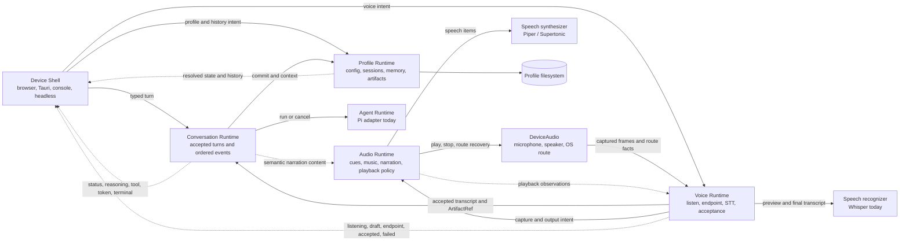

The important ownership rules are:

- Profile Runtime is the only canonical writer of user state.
- Voice accepts speech; Conversation does not own microphone policy.
- Conversation emits meaning, not playback files.
- Audio Runtime owns what may be audible on its device.
- Platform code adapts IO but does not recreate product policy.

## 2. Dependency direction inside `wheatleyd`

`WheatleyApi` is the composition root. Callers depend on the small
`ConversationPort`; startup chooses exactly one implementation. The ordinary
local composition uses direct typed calls rather than loopback HTTP.

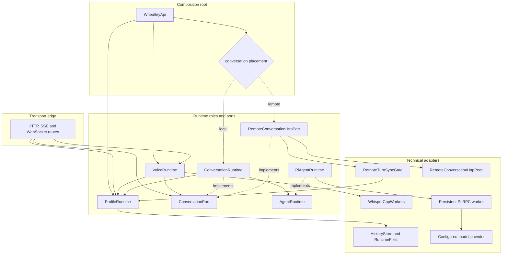

The port isolates a real placement choice. Profile, Voice, and local
Conversation remain direct concrete collaborators; they are not wrapped merely
to make the graph look layered.

## 3. Current deployment shapes

### 3.1 Standalone local appliance

This is the fully local shape for a Mac, Pi 5, or N150-class machine. The whole
product can work without the server or WAN when its configured provider and
models are local.

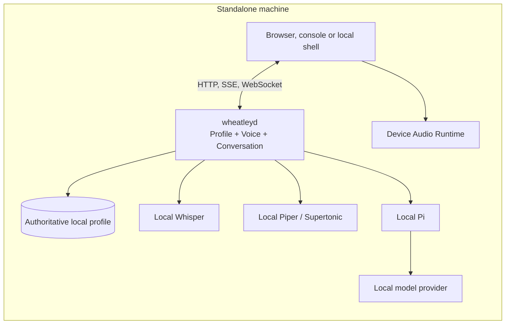

### 3.2 Synced hybrid with remote Conversation

The appliance keeps capture, Whisper, speech, playback, and a bounded profile
replica local. It synchronizes history and sends accepted Conversation work to
one paired authority. A network failure is visible; this composition never
runs local Pi as an unannounced mid-turn fallback.

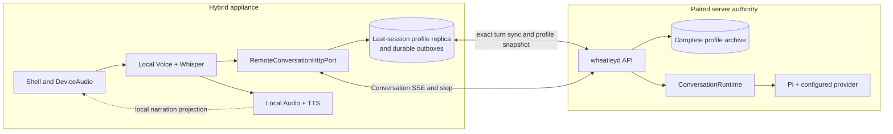

### 3.3 Thin browser or Tauri client

This is the intended initial iOS composition. The client owns platform audio,
presentation, a bounded music cache, and accepted-turn metadata. The server
owns Profile, Whisper, Conversation, Pi, and the configured Wheatley voice.

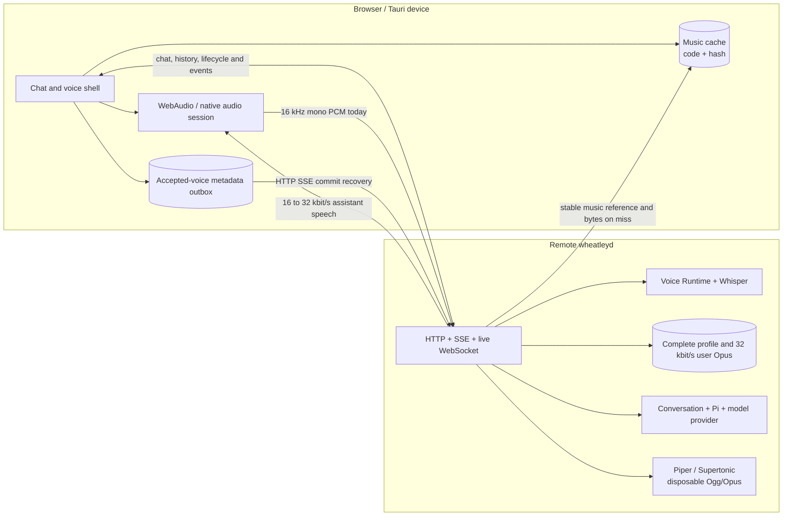

## 4. Transport responsibilities

Transport follows the actual interaction shape. It is not a universal internal
bus.

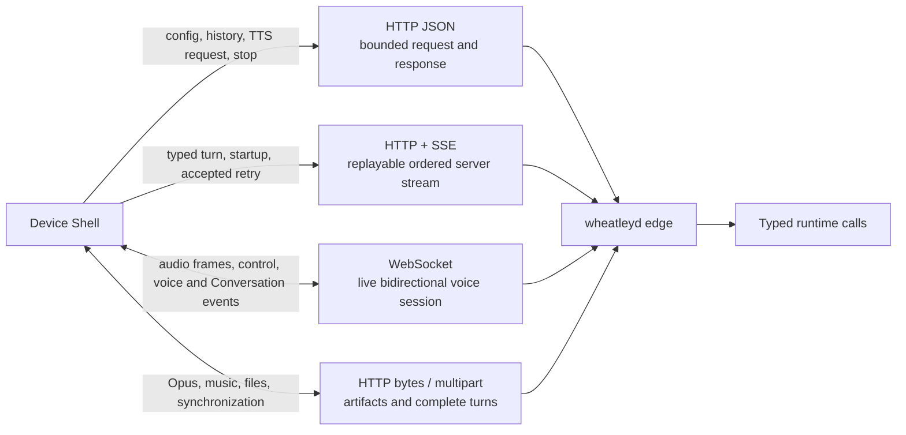

- **Direct typed calls:** default between roles in one process.
- **WebSocket:** microphone frames and interactive voice control before and
  during one live session; it also carries the common Conversation envelope.
- **SSE:** one-way ordered output that benefits from an HTTP request body and a
  durable replay cursor, including text turns and accepted-voice recovery.
- **HTTP JSON:** bounded commands and snapshots.
- **HTTP bytes or multipart:** potentially large media and sync artifacts;
  normal events never contain base64 blobs.

## 5. Voice lifecycle state machine

This is server Voice coordination. Capture and playback adapters react to these
states but do not invent their own acceptance policy.

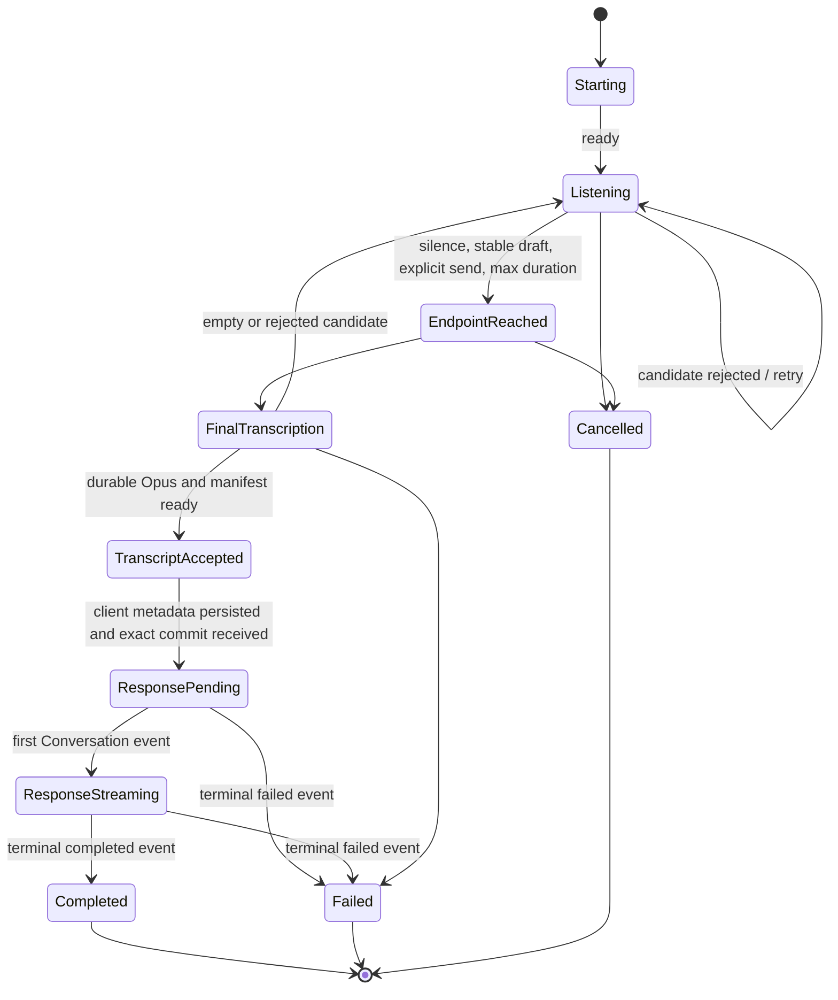

`EndpointReached` is not yet an accepted user turn. Acceptance occurs only
after the selected audio is normalized and its exact manifest is durable.

## 6. Accepted voice turn and crash recovery

The accepting daemon owns the only durable user-audio copy. The client outbox
contains metadata and a replay cursor, not another PCM or Opus recording.

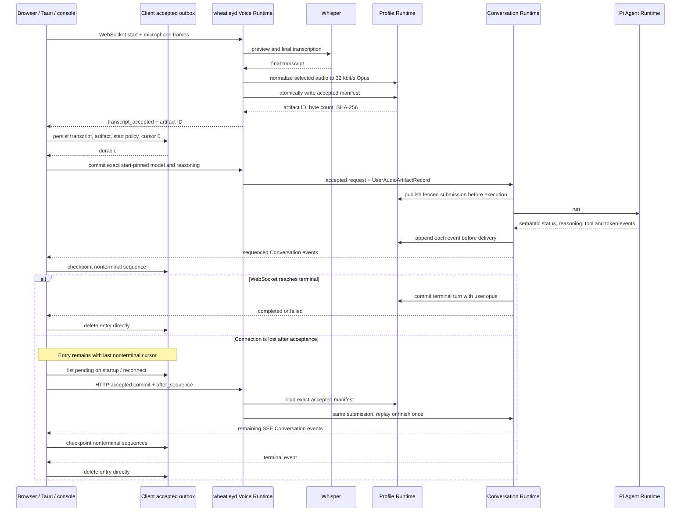

If the connection fails before `transcript_accepted`, the capture is retried;
Wheatley does not splice or pretend to replay an uncertain live recording.

## 7. Remote Conversation handoff

The local terminal event is deliberately delayed until the exact remote turn
and artifacts have been materialized locally.

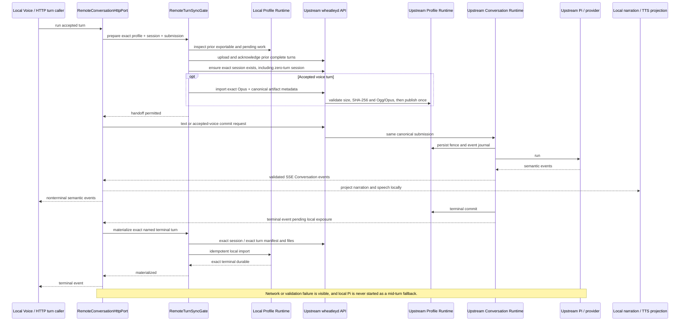

## 8. Paired-appliance history synchronization

Synchronization copies complete immutable work; it never mounts one live
iCloud profile as a multi-writer filesystem.

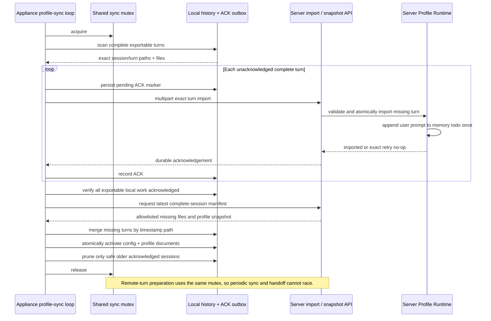

The intentionally simple collision rule is first-file-wins. A rare same-second
session collision may merge; the first session/Pi files stay authoritative and
a different Pi log is preserved as `pi_session_2.jsonl` rather than rebuilt.

## 9. Data ownership and retention

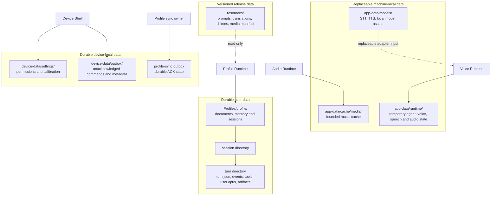

Only `Profiles/` is canonical user history. Device outboxes are durable until
acknowledged but are not a second profile authority. Caches and generated
assistant speech are disposable; accepted user speech is not.

## Reading order

For a quick orientation, read diagrams 1, 3.2, and 6. For implementation work,
use diagram 2 to find dependency direction, diagram 4 to choose a transport,
and the relevant sequence before changing a boundary. The prose documents and
code remain authoritative when a diagram becomes stale.
