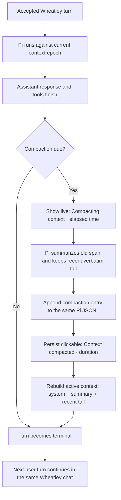

# Context Compaction

Status: initial native-Pi integration implemented and machine-verified,
2026-08-16. Capacity-policy tuning, historical reconciliation, and real
multi-compaction continuation probes remain evidence-gathering work.

## Outcome

A Wheatley chat should remain useful for practically unbounded work even though
each model has a finite context window.

The user keeps one ordinary Wheatley chat. Internally, Pi periodically replaces
the oldest active model context with a continuation summary while retaining a
recent verbatim tail. The complete Wheatley transcript and complete append-only
Pi history remain available; only the context sent to the model becomes
smaller.

During the operation, the active client shows `Compacting context · 12 s` with
an elapsed counter. When it finishes, that live status becomes a durable
clickable separator such as `Context compacted · 18 s` at the exact context
boundary in the conversation. The summarization prompt never appears. The
summary is collapsed by default, but the user can expand that one separator or
enable `Show compacted context` to inspect every compacted context as a
read-only Markdown bubble. Compaction content is never read automatically.

This is **practically unbounded**, not literally lossless or infinite.
Summarization is lossy, repeated summaries can drift, storage is finite, and
external processes can fail. The design therefore preserves full source
history and treats durable project files or task state as more authoritative
than the model's active context.

## Recommendation

Use Pi's existing native compaction mechanism inside the existing Pi session.
Do not create hidden synthetic conversation turns and do not replace the Pi
session merely because context was compacted.

One Wheatley session continues to own:

- one complete user-visible conversation;
- one append-only Pi session file;
- zero or more Pi compaction entries; and
- one current active context epoch derived from the latest compaction entry.

Pi owns the low-level compaction mechanism and compacted-context reconstruction.
Wheatley owns product policy, semantic progress events, diagnostics, and client
presentation.



## Validated facts

### Pi behavior

As verified against the installed Pi 0.83.0 package and the current upstream
0.84.2 documentation on 2026-08-16:

- Pi already enables automatic compaction by default.
- Normal automatic compaction runs after an agent response reaches its end and
  before Pi emits `agent_settled`.
- Pi can also compact manually through its RPC `compact` command.
- Pi emits `compaction_start` and `compaction_end` events with reason
  `manual`, `threshold`, or `overflow`.
- A successful compaction appends a `compaction` entry to the same session JSONL.
  It does not delete the earlier entries.
- The next model request receives the system prompt, the compaction summary,
  and recent retained messages starting at `firstKeptEntryId`.
- Repeated compaction includes the previous summary and re-summarizes the span
  that survived the previous boundary, rather than stacking unrelated summaries.
- Pi normally cuts at complete user-turn boundaries. It has explicit handling
  for one unusually large turn that must be split.
- Pi keeps tool calls with their tool results, truncates large tool-result text
  during summary serialization, and cumulatively tracks read and modified files.
- Pi can compact after a context-overflow response and retry once. A completed
  answer that merely reports usage beyond the configured window may be compacted
  without replaying that already completed answer.
- The summary-generation request uses a fresh provider routing session ID, but
  this is not a new Pi conversation or a new Wheatley chat.
- Pi's current default trigger is capacity-based:
  `contextTokens > contextWindow - reserveTokens`. Upstream defaults are 16,384
  reserved tokens and 20,000 recent tokens.
- The current local Pi settings used by Wheatley enable compaction with 12,288
  reserved tokens and 24,000 recent tokens. Those absolute values are usable
  for the current 131K model but are not a suitable cross-model product policy.

Primary references:

- [Pi compaction design and session format](https://github.com/earendil-works/pi/blob/main/packages/coding-agent/docs/compaction.md)
- [Pi RPC compaction commands, state, statistics, and events](https://github.com/earendil-works/pi/blob/main/packages/coding-agent/docs/rpc.md)
- [Pi example of threshold-triggered extension compaction](https://github.com/earendil-works/pi/blob/main/packages/coding-agent/examples/extensions/trigger-compact.ts)

### Implemented Wheatley behavior

- Each Wheatley session maps to one Pi JSONL, and its warm per-session
  Pi RPC worker resumes that exact file.
- Wheatley waits for Pi's `agent_settled`, not merely the earlier `agent_end`.
  Native Pi compaction can therefore already finish before Wheatley declares
  the turn complete.
- `PiEventCollector` maps `compaction_start` and `compaction_end` to semantic
  lifecycle events, diagnostics, and ordered presentation items. Automatic,
  manual, threshold, and overflow reasons retain Pi's native meaning.
- Wheatley's filesystem turn/session history owns the complete user-visible
  transcript independently of the active model context. Compaction must not
  shorten this history.
- Same-session accepted work is serialized through Wheatley's FIFO execution
  lane. A later accepted turn can wait safely while the preceding turn compacts.
- The model catalog now preserves Pi's exact `contextWindow`; conversation LLM
  metrics record it alongside each compaction's reason, duration, token counts,
  usage, result details, and error/retry facts.
- Web/Tauri exposes native `Compact now`, the profile-local off-by-default
  `Show compacted context` preference, an always-visible timed separator, and
  per-separator summary expansion. Summaries are distinct maintenance content,
  never assistant messages, and never enter automatic speech.
- Text and voice consoles print automatic compaction lifecycle notices. Voice
  announces only concise start/completion/failure labels, never the summary.
  A resumed console session prints completed separators from presentation
  history.
- Pi settings currently come from Pi's ordinary global/project configuration.
  Wheatley deliberately leaves automatic compaction enabled and unchanged; it
  does not yet have a non-persisting per-session threshold override.

## Product behavior

### One chat, multiple context epochs

Treat a successful compaction as a new **active context epoch**, not a new
session. The term is conceptual; Pi's existing compaction entry can remain the
only persisted boundary unless implementation evidence requires another field.

The user-visible identity does not change:

- same chat URL;
- same recent-chat row and title;
- same Wheatley session directory;
- same paired Codex thread, if one exists;
- same complete transcript and artifacts; and
- same Pi JSONL.

Creating a new Pi session would introduce a second identity and handoff chain,
complicate restart and model switching, weaken inspectability, and duplicate a
mechanism Pi already implements.

### Invisible internal exchange

The model call that generates the continuation summary is runtime maintenance,
not a user or assistant message. Wheatley may project its result as a distinct
inspectable `compacted context` presentation item, but it must never mislabel it
as ordinary conversation.

It must not create:

- a user bubble containing a hidden instruction;
- an assistant bubble containing the summary;
- a TTS request;
- a reasoning/activity box attributed to an assistant message;
- a notification or unread-chat marker; or
- user-visible turn numbering.

The always-visible separator and optional summary bubble are the only normal
conversation-surface projection. The raw Pi session remains canonical.

### Live progress and durable boundary

When Pi emits `compaction_start`, Conversation should publish one semantic
maintenance item. While running, the selected web/Tauri client should show:

```text
Compacting context · 12 s
```

Recommended behavior:

- show the elapsed counter using the same timing treatment as other long work;
- render it as a thin full-width separator line at the exact ordered context
  boundary, not as a user or assistant bubble;
- do not automatically speak it in web/Tauri;
- let already available response speech begin normally;
- keep Home's existing processing indicator active until compaction settles;
- reconstruct the running status when the user leaves and reopens the chat;
- on success, freeze the elapsed duration and label as
  `Context compacted · 18 s`;
- retain every completed separator in normal history and exports;
- also project older Pi compaction entries created before this feature as
  `Context compacted` separators with clickable summaries but no invented
  duration;
- make the label clickable to expand or collapse only that compaction summary;
- render an expanded summary immediately below its separator as a visually
  distinct read-only Markdown bubble;
- exclude the summary from automatic speech even when automatic speech is on;
- retain ordinary manual Copy and, if the common bubble toolbar supplies it,
  manual Speak without treating either as assistant output; and
- use localized English and Slovak text.

Console prints concise lifecycle notices and a durable separator with duration.
The voice console also speaks a short event announcement, never the summary.
It keeps summaries hidden unless its own explicit inspect command is later
added. No separate thinking-music rule is needed initially.

### Chat-menu controls

Add two items to the existing chat three-dot menu:

1. **Compact now** — one action that invokes Pi's native manual RPC compaction
   through Wheatley's exact-session execution owner. The browser never calls Pi
   directly. The operation holds the normal session-use lease and Pi-run slot,
   but creates no user turn and no assistant message. It is enabled only while
   the chat is idle and no compaction is running. If Pi reports
   `Nothing to compact` or `Already compacted`, show a small transient notice
   and do not create a separator because no context boundary changed.
2. **Show compacted context** — a checked menu preference, off by default,
   stored with the same profile-local client preference ownership as
   `Show thinking`. When on, all successful compaction summaries in the opened
   chat are expanded by default. When off, all are collapsed by default.

Clicking one `Context compacted · <duration>` label toggles that summary
independently of the global preference. This per-entry override is local view
state and need not persist across reload; after reload, the menu preference
again supplies the default. This keeps verification one click away without
turning internal summaries into permanent visual weight.

While a manual or automatic compaction runs, `Compact now` is disabled and may
temporarily read `Compacting…`. Do not queue multiple manual compactions or
allow the menu action to interrupt an active assistant/tool turn.

### Failure

A compaction failure must not erase or reclassify the assistant response that
already completed. Record the exact failure in turn/session diagnostics and
end the transient progress state.

Recommended initial presentation:

- convert a started failed operation into a durable
  `Context compaction failed · <duration>` separator so the event does not
  disappear;
- do not create a summary bubble when no summary became active;
- retry at the next safe preflight boundary;
- make the failed separator's label expose the short exact error on click or
  hover while keeping the main transcript calm;
- show a stronger visible warning when Wheatley cannot safely start the next
  model request; and
- keep Pi's one compact-and-retry overflow behavior as emergency recovery, not
  as the normal scheduling policy.

A failed summary is never appended as the active boundary. On restart, the last
complete compaction entry—or the original full context if none exists—remains
canonical.

## Capacity policy

### Why neither a percentage nor an absolute token count is enough

`75% used` is a reasonable first high-water mark, but it is not a complete
design:

- 8K free means very different safety in a 32K window than in a 256K window;
- one tool-heavy turn can add much more context than a short chat response;
- a switch from a large-window model to a small-window model can make the
  existing context unsafe immediately;
- very large future windows may be technically available but unnecessarily
  slow, expensive, or less reliable to fill; and
- the retained recent tail must also scale instead of remaining 20K in every
  window.

Use three independent inputs:

1. **Window capacity** — the selected model's exact context window.
2. **Turn headroom** — enough remaining space for one bounded large turn,
   including output, tool calls/results, images, and a safety margin.
3. **Useful working-set ceiling** — the largest active context Wheatley is
   willing to carry even when a future model exposes much more capacity.

Use **current active-context tokens**, never cumulative tokens consumed across
the life of the chat. Prefer provider-reported usage from the latest successful
assistant response, then add a bounded estimate for content accepted since that
measurement. Pi deliberately reports context usage as unknown immediately after
compaction until a fresh assistant response supplies new usage; the compact
result's `estimatedTokensAfter` is suitable for diagnostics and scheduling but
must remain labelled as an estimate.

Candidate proactive high-water formula:

```text
highWater = min(
    75% of contextWindow,
    contextWindow - turnHeadroom,
    192K usefulWorkingSetCeiling
)
```

Compaction is due after a successful response when estimated active context is
at or above `highWater`. The 75% and 192K values are starting hypotheses for
replay testing, not accepted constants.

Candidate retained-tail formula:

```text
keepRecent = clamp(20% of contextWindow, 8K, 32K)
```

Illustration, before applying a stricter turn-headroom constraint:

| Model window | Proactive high water | Recent verbatim tail |
| ---: | ---: | ---: |
| 32K | 24K | 8K |
| 64K | 48K | about 13K |
| 128K | 96K | about 26K |
| 256K | 192K | 32K |
| 1M future window | 192K ceiling | 32K |

The important contract is not these exact numbers. It is that the trigger is
derived from model capacity, next-turn safety, and an operational working-set
limit. A replay probe should choose the initial values.

### Trigger boundaries

There are three legitimate triggers:

1. **Proactive boundary** — normal path after a successful assistant response
   and all of its tools finish.
2. **Preflight boundary** — before a new request if a smaller selected model,
   a large new input, or stale usage leaves insufficient turn headroom.
3. **Overflow recovery** — emergency Pi behavior after a provider reports
   context overflow; compact and retry at most once.

The proactive boundary should handle ordinary use. Preflight prevents a model
switch or large input from relying on failure. Overflow recovery covers
estimation and provider-reporting errors.

Do not compact during an active tool call or between a tool call and its result.
Do not start a second compaction while one is in progress.

## Continuation summary

The summary is the new initialization state for older work. It should preserve
decisions and resumable state, not imitate the conversation or reproduce hidden
reasoning.

Recommended content:

```markdown
## Goal

## User Constraints And Preferences

## Current State

### Completed

### In Progress

### Blocked

## Decisions And Rationale

## Important Facts And Evidence

## Open Questions

## Next Actions

## Critical References
```

Rules for the compaction prompt:

- preserve the user's latest correction when it conflicts with an earlier one;
- distinguish completed actions from proposals and intended next actions;
- retain exact identifiers, paths, URLs, commands, errors, measurements, and
  external task handles only when they matter for continuation;
- preserve unresolved user requests and material acceptance criteria;
- preserve uncertainty as uncertainty and assumptions as assumptions;
- include durable file and artifact locations instead of copying large content;
- summarize decision rationale and evidence, not private chain-of-thought;
- omit greetings, conversational repetition, obsolete branches, and already
  corrected mistakes; and
- remain concise enough that summary plus recent tail leaves substantial room.

Pi's existing structured default is already close to this shape. The initial
implementation should use native Pi summarization and measure its continuation
quality before introducing a separate compaction model or custom summarizer.

## Ownership and persistence

| Fact or behavior | Owner |
| --- | --- |
| Full user-visible conversation and artifacts | Wheatley history store |
| Full append-only agent history | Pi session JSONL |
| Compaction algorithm, entry, cut point, and active-context rebuild | Pi |
| Product trigger values and model-capacity policy | Wheatley Agent Runtime |
| Mapping Pi compaction events to semantic status and diagnostics | Wheatley Pi adapter |
| Turn ordering while compaction runs | Wheatley per-session execution lane |
| Durable ordered separator, duration, reason, result, and initial summary snapshot | Wheatley presentation sequence |
| Canonical compaction summary and active-context source | Pi session JSONL |
| Menu preference and per-entry expand/collapse state | Client presentation |

Do not copy the summary into `turn.md`, assistant text, or a second Wheatley
conversation message. Pi's RPC result does not currently expose the stable JSONL
entry ID, so this initial slice stores the returned summary as a read-only
presentation snapshot for immediate replay while Pi JSONL remains canonical.
Resolving presentation by stable Pi entry ID is a follow-up once that ID is
available. Persist compact diagnostics with the turn's normal LLM metrics:

- reason;
- start and end time;
- tokens before;
- estimated tokens after;
- selected model and context window;
- summary-generation usage;
- retained-tail setting;
- compaction-entry ID when available; and
- terminal success, abort, or exact error.

The Pi compaction entry remains the canonical summary. Any Wheatley metadata is
only a diagnostic projection.

The initial slice replays compactions recorded after this feature from
Wheatley's presentation journal. A follow-up should reconcile Pi compaction
entries with Wheatley's durable
presentation references. If Pi contains an unrepresented successful entry—for
example from an older Wheatley version or a crash after Pi appended the summary
but before presentation finalization—insert it into the history projection by
its Pi timestamp. Show a duration only when Wheatley actually recorded both
ends; never estimate or fabricate historical elapsed time.

## Implementation seam to resolve

Pi currently reads absolute compaction values from ordinary global/project
settings. Its RPC `set_auto_compaction` command changes the persisted global
enabled flag, and there is no RPC command for non-persisting per-session
`reserveTokens` and `keepRecentTokens` overrides.

Wheatley should not mutate the maintainer's general Pi settings, write `.pi` settings
into an external user workspace, or silently depend on one
developer machine's values.

Preferred implementation direction:

1. first expose Pi's native compaction start/end events in Wheatley and verify
   the already-active mechanism end to end;
2. preserve `contextWindow` in Wheatley's model/runtime contract;
3. measure the candidate policy through replays at several window sizes; and
4. add one explicit, non-persisting per-worker Pi compaction-policy seam—ideally
   upstream RPC/runtime support—only after the required values are known.

An extension-triggered compaction is also technically possible because Pi
extensions can inspect current context usage and call `compact()`. It should not
become a second competing threshold owner beside Pi's automatic policy. Choose
one normal trigger owner during implementation.

## Assumptions

- Pi's append-only compaction entry remains stable enough to be Wheatley's
  mechanism boundary.
- The selected chat model can produce an adequate continuation summary for the
  initial slice.
- Tool outputs and accepted input sizes remain bounded so `turnHeadroom` can be
  meaningful.
- Wheatley's complete transcript remains independent of Pi's active-context
  projection.
- Summary generation may use the same model slot and add latency after the
  visible answer; this is acceptable if clearly presented and infrequent.
- Compaction is session maintenance, so a queued same-session turn waits while
  other Wheatley sessions may continue under the existing concurrency gate.

## Uncertainties and open questions

1. **Initial high water:** Is 75% the right proactive point for Qwen at 131K,
   or does latency/quality justify an earlier absolute ceiling?
2. **Turn headroom:** What bounded output/tool/image budget reflects real Primary
   and secondary-profile turns? This should be measured rather than guessed from model max
   output alone.
3. **Summary model:** Is the active local model reliable across three or more
   successive compactions, or should profiles optionally select a separate
   summarizer later?
4. **Reasoning level:** Pi currently uses the active thinking level for summary
   generation. Does compaction need a fixed, cheaper level?
5. **User activity:** Should a newly accepted same-session prompt remain merely
   queued while compaction finishes, or should the UI also say it is waiting for
   context preparation? The recommended initial behavior is normal queued work.
6. **Model switch:** Preflight behavior when moving from a larger to a smaller
   window needs a real RPC test, even though Pi's current code checks compaction
   before prompt submission.
7. **Crash boundary:** Pi appears recoverable if killed before or after the
   append-only compaction entry, but exact worker/daemon restart behavior needs
   an interrupted-run test.

## Implemented initial scope

- normal Pi-backed Wheatley conversations;
- native same-session compaction;
- a chat-menu `Compact now` action;
- an off-by-default `Show compacted context` preference;
- durable timed separators and individually expandable summary bubbles;
- context-window exposure and compaction metrics for a future capacity policy;
- hidden summary exchange;
- live progress, durable results, and diagnostics;
- same-session serialization and native overflow behavior; and
- web/Tauri and console presentation expectations.

## Not now

- replacing Pi's compaction algorithm;
- a new Pi session per context epoch;
- a generic job or maintenance queue;
- RAG, embeddings, or retrieval over the full transcript;
- automatic mutation of project status files before every compaction;
- compaction of the independent native Codex thread;
- a user-editable compaction prompt in the instruction editor;
- treating compaction summaries as user or assistant messages; or
- claiming mathematically infinite or lossless conversation.

Codex owns its own thread and context behavior. Wheatley/Pi compaction may retain
the durable Codex association and current dispatch status, but it must not
rewrite or compact Codex's native history.

## Verification

Completed on 2026-08-16:

- all 92 D unittest modules pass;
- server, console, and Codex-worker D builds pass;
- TypeScript typecheck, ESLint, and the production Vite build pass;
- deterministic Firefox UI checks verified collapsed and expanded summaries,
  the checked global preference, native manual action, live elapsed timer,
  disabled action while compacting, and zero browser console errors in the
  successful flow; and
- default and current private profile configurations include the new
  off-by-default preference without changing Pi's automatic policy.

The initial full-daemon probe exposed a stale private-config key:
`lmstudio/qwen/qwen3.8-27b` instead of Pi's live
`lmstudio/qwen3.8-27b`. It was corrected on 2026-08-16; the LAN daemon now starts
and reports healthy. A later exact-session probe also fixed cold manual-worker
initialization and now returns a truthful successful no-op for a session too
small to compact. The same pass fixed a pre-existing presentation/Pi JSONL
selection collision and recovered the affected one-turn Primary session. Real
successful-compaction, restart, overflow, and
repeated-continuation probes still remain before accepting the candidate
capacity constants.

### Remaining verification plan

### Mechanism probe

Use an isolated profile and deliberately small effective context windows to
exercise compaction quickly:

1. complete several ordinary turns with tools;
2. cross the proactive threshold after a successful answer;
3. observe `compaction_start`, `compaction_end`, then `agent_settled`;
4. verify exactly one compaction entry was appended to the same Pi JSONL;
5. verify old entries remain byte-present and the next request uses summary plus
   retained tail; and
6. verify Wheatley's complete transcript is unchanged.

### Continuation-quality replay

Replay representative long work at 32K, 64K, 128K, and 256K policies, including
at least three successive compactions. After each boundary, ask questions whose
answers are known from the compacted span:

- current goal;
- latest user correction;
- accepted constraints;
- completed versus proposed work;
- exact important file/artifact path;
- one unresolved blocker; and
- correct next action.

Record answer correctness, summary size, tokens before/after, compaction time,
and any lost or falsely invented state. Include a tool-heavy turn and a model
switch from a larger to a smaller window.

### Lifecycle and UI checks

- close or switch chat during compaction, then reopen and see the reconstructed
  elapsed status;
- complete automatic and manual compactions and verify their separator, duration,
  exact ordering, and summary-entry reference survive reload;
- open a pre-feature or deliberately unreferenced Pi compaction entry and verify
  it receives one correctly ordered separator without a fabricated duration;
- use `Compact now` while idle, and verify it is disabled during a turn and
  while another compaction runs;
- toggle `Show compacted context`, then click individual separators in both
  global states and verify their local overrides;
- queue another same-session prompt and confirm FIFO continuation;
- verify another session can run according to the existing concurrency gate;
- restart the Pi worker before summary append and after summary append;
- force one compaction failure and one provider overflow;
- verify no hidden prompt appears and summaries appear only in their distinct
  compacted-context bubbles when expanded;
- verify automatic speech, assistant Copy, unread indicators, and user-visible
  turn numbering ignore compaction content;
- verify response TTS may proceed while compaction finishes; and
- verify Home processing state clears only after Pi settles.

## Acceptance criteria

The initial slice is acceptable when:

1. one Wheatley chat continues correctly through at least three compactions;
2. no new Wheatley or Pi conversation identity is created;
3. full Wheatley and Pi source histories remain recoverable;
4. the active context after compaction is materially below its high-water mark;
5. required goals, corrections, decisions, state, and next actions survive the
   continuation-quality probe;
6. every attempted compaction that starts has a durable localized separator
   with duration and terminal result;
7. summaries are collapsed by default, expand globally or individually, and
   are never automatically spoken or mistaken for assistant output;
8. queued turns, other sessions, navigation, restart, model switching, and one
   overflow recovery behave predictably; and
9. failure cannot silently replace the last known-good active context boundary.

## Initial slice result

The native behavior is now visible without custom summarization:

1. **Done:** recognize Pi `compaction_start` and `compaction_end` in the existing event
   adapter;
2. **Done with a summary snapshot:** add one durable compaction item to the
   existing ordered presentation sequence and record duration/result;
3. **Done:** render its live and terminal separator states in web/Tauri and console;
4. **Done:** add the web/Tauri `Compact now` action and `Show compacted context` toggle,
   plus per-separator expansion without automatic speech;
5. **Done for newly recorded events:** restore separators and optional summaries
   from presentation history;
6. **Done:** record compact diagnostics beside existing LLM metrics;
7. **Pending real provider availability:** run forced automatic/manual
   compaction, same-session, repeated-summary, and
   restart probes; and
8. **Pending those probes:** choose scaling constants or a new Pi runtime-policy seam from real
   token and continuation evidence.

This slice uses the mechanism already running in production, exposes its true
state, and leaves threshold customization as the next evidence-backed decision.
